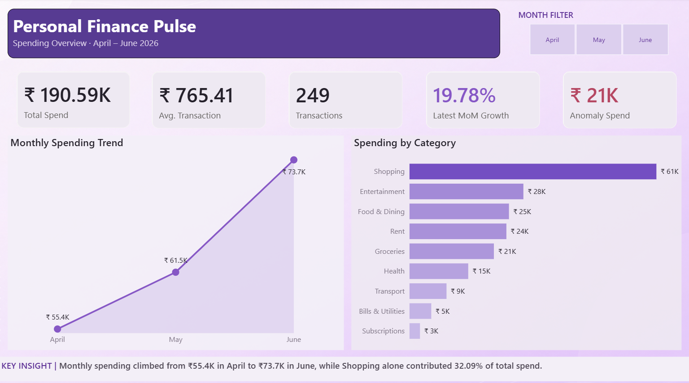
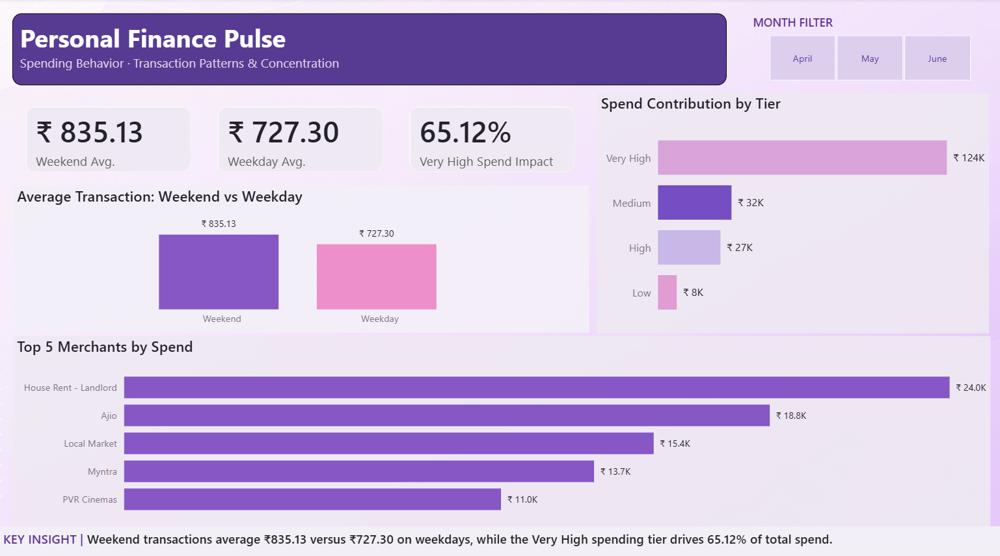
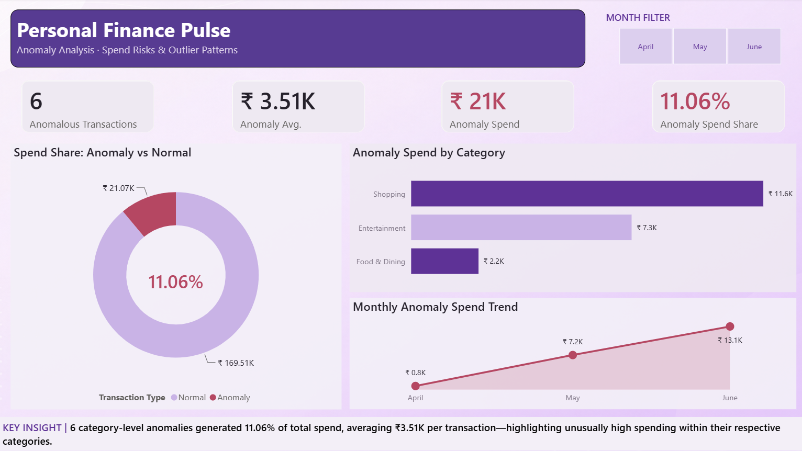

# FinPulse — Personal Finance Analytics Pipeline

FinPulse is an end-to-end data analytics project that transforms raw personal transaction data into actionable spending insights through a Python ETL pipeline, MySQL analysis, and an interactive Power BI dashboard.

The project focuses on identifying spending patterns, category concentration, month-over-month growth, and high-value anomalous transactions.

## Project Architecture

```text
Synthetic Transaction Data
        ↓
Python ETL Pipeline
        ↓
Cleaned & Feature-Engineered Dataset
        ↓
MySQL Database
        ↓
SQL Analysis
        ↓
Power BI Data Model & DAX
        ↓
Interactive Finance Dashboard
```

## Dashboard

### Spending Overview



Provides an executive view of total spending, transaction activity, monthly growth, anomaly spend, and category-level contribution.

### Spending Behaviour



Explores transaction behaviour across weekdays and weekends, spending tiers, and high-impact merchants.

### Anomaly Analysis



Investigates high-value outlier transactions and measures their contribution to overall spending.

## Key Insights

- Total spending reached **₹190,587.01 across 249 processed transactions**.
- Monthly spending increased **11.11% in May** and accelerated by **19.78% in June**.
- **Shopping contributed 32.09% of total expenditure**, making it the largest spending category.
- Only **6 category-level anomalies accounted for 11.06% of total spend**.
- Anomalous transactions averaged **₹3,512.08**, compared with **₹697.59 for normal transactions**.
- Weekend transactions averaged **₹835.13**, higher than the weekday average of **₹727.30**.
- The **Very High spending tier represented 21.29% of transactions but generated 65.12% of total spending**.
- Shopping remained the highest-ranked category each month, while Entertainment and Groceries became stronger spending drivers in June.

## ETL Pipeline

The Python ETL pipeline in `scripts/etl.py` performs:

1. Raw CSV extraction
2. Schema validation
3. Duplicate transaction removal
4. Missing value handling
5. Data type conversion
6. Text standardization
7. Date-based feature engineering
8. Spending tier classification
9. Category-level IQR anomaly detection
10. Processed CSV export
11. MySQL database loading
12. Database row-count verification

The pipeline reduced **252 raw transactions to 249 validated transactions** after removing duplicate records.

## Feature Engineering

The ETL process creates analytical features including:

- Year
- Month
- Month number
- Day
- Weekday
- Weekend indicator
- Spending tier
- Anomaly flag

Anomalous transactions are identified using **category-level Interquartile Range (IQR) detection**. Transactions are evaluated within their spending category rather than against the global transaction distribution. Categories with fewer than five observations are excluded from anomaly flagging to reduce unreliable classifications from sparse groups.

## SQL Analysis

Analytical SQL queries are available in `sql/queries.sql`.

The analysis includes:

- Overall spending KPIs
- Category spending contribution
- Month-over-month growth using `LAG()`
- Anomaly impact analysis
- Weekend vs weekday spending behaviour
- Merchant concentration using `DENSE_RANK()`
- Spending tier distribution
- Monthly category ranking using CTEs and `PARTITION BY`

SQL concepts demonstrated:

`CTEs` · `Window Functions` · `LAG()` · `DENSE_RANK()` · `PARTITION BY` · `GROUP BY` · `CASE`

## Power BI Data Model

Power BI connects directly to the MySQL `finpulse` database.

A dedicated Calendar table was created and linked to the transaction table using a one-to-many relationship.

Key DAX measures include:

- Total Spend
- Transaction Count
- Average Transaction
- Previous Month Spend
- MoM Growth %
- Latest MoM Growth %
- Anomaly Spend
- Anomaly Spend %
- Anomaly Count
- Anomaly Average Transaction
- Weekend Average Transaction
- Weekday Average Transaction
- Very High Spend %
- Spend Contribution %

The dashboard includes a synchronized month slicer across all three report pages.

## Project Structure

```text
finpulse/
├── dashboard/
│   └── finpulse.pbix
├── data/
│   ├── processed/
│   │   └── expenses_clean.csv
│   └── raw/
│       └── expenses_raw.csv
├── images/
│   ├── anomaly_analysis.png
│   ├── spending_behaviour.png
│   └── spending_overview.png
├── scripts/
│   ├── etl.py
│   └── generate_data.py
├── sql/
│   └── queries.sql
├── .gitignore
├── README.md
└── requirements.txt
```

## Tech Stack

- **Python**
- **Pandas**
- **SQLAlchemy**
- **MySQL**
- **SQL**
- **Power BI**
- **DAX**
- **Power Query**
- **Git & GitHub**

## Running the ETL Pipeline

### 1. Clone the repository

```bash
git clone <repository-url>
cd finpulse
```

### 2. Install dependencies

```bash
pip install -r requirements.txt
```

### 3. Configure database credentials

Create a `.env` file in the project root:

```env
DB_USER=your_mysql_username
DB_PASSWORD=your_mysql_password
DB_HOST=localhost
DB_NAME=finpulse
```

Create the MySQL database:

```sql
CREATE DATABASE finpulse;
```

### 4. Run the ETL pipeline

```bash
python scripts/etl.py
```

The pipeline cleans the raw dataset, generates analytical features, exports the processed dataset, and loads the final transaction table into MySQL.

## Dashboard Story

FinPulse follows a three-stage analytical narrative:

**Spending Overview → Spending Behaviour → Anomaly Analysis**

The report first identifies overall financial trends, then explores behavioural spending patterns, and finally investigates unusually high transactions relative to their spending categories.
